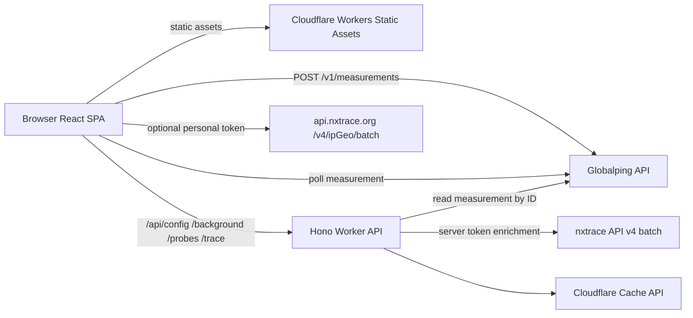

# GlobalTrace

GlobalTrace 是一个 Globalping x NextTrace 的开源项目，借助 Globalping 遍布全球的 Probe 发起路由追踪，并结合 NextTrace 骨干网 IP 数据库增强地理位置与网络归属信息。

## 主要能力

- 支持 ICMP、TCP、UDP，以及 IPv4 / IPv6 目标诊断；可按国家或地区、城市、ASN、网络、Tag 和网络类型筛选 Probe。
- 可通过 Magic 搜索、地图点选、同地点 ASN 候选和地图框选组合 Probe；筛选建议来自当前在线 Probe。
- 桌面端可选择地图优先或表格优先布局。地图优先模式将 Probe 列表收纳到抽屉中；选择会保存在当前浏览器。
- 诊断结果在桌面端使用可拖拽侧滑面板，在窄屏使用底部面板；关闭后仍可从工作区重新打开。
- 多 Probe 结果以标签页展示目标延迟、丢包、逐跳 MTR、NextTrace GeoIP/ASN/whois、原始输出和失败详情。
- 结果地图支持 2D 墨卡托和 3D Globe，可从地图切换 Probe、展开重叠跳点，也可从跳点表定位对应路径节点。
- 支持分享 measurement 链接、带来源署名的 Bing 每日背景、浅色/深色主题、中英文界面、响应式布局和键盘操作。

## 使用流程

1. 输入目标域名或 IP，选择协议、IP 版本及可选的端口、包数和 Probe 数量。
2. 使用 Magic、精确条件或地图选择 Probe；页脚会显示当前可用的 Globalping 额度。
3. 开始诊断后等待 Globalping measurement 完成，GlobalTrace 会读取结果并补充 NextTrace 数据。
4. 在 Probe 标签、跳点明细和 2D/3D 路径地图间检查结果，或复制分享链接。

## 技术栈

- Frontend：React + Vite + TypeScript + MapLibre。
- UI：Radix UI、lucide-react。
- Worker：Hono on Cloudflare Workers Static Assets。
- 测量来源：Globalping `type: "mtr"` measurement。
- 增强数据：Worker 按 Globalping measurement ID 拉取可信结果后调用 nxtrace API v4 batch GeoIP/ASN/whois；用户提供个人 NextTrace API Token 后，新建诊断可由浏览器直连 batch API。

## 架构

GlobalTrace 是一个 Cloudflare Worker 托管的 React SPA + API Worker。`/api/*` 先进入 Hono Worker，其他路径由 Cloudflare Workers Static Assets 返回 Vite 构建出的 SPA 静态资源。



诊断创建由浏览器直接调用 Globalping；Worker 不代理创建 measurement。Worker 负责可信读取 measurement、转换 MTR 结果、调用 nxtrace enrichment、返回分享结果缓存，以及服务 `/api/config`、`/api/probes`、背景图等站点 API。

用户提供的 Globalping / NextTrace Token 只保存在当前浏览器会话或用户明确记住的本机存储中。Worker secret 只用于服务端 `NXTRACE_API_V4_TOKEN`，项目不使用 KV、D1、R2、Durable Object 或服务端报告存储。

## 本地运行

```bash
npm install
npm run dev
```

`npm run dev` 通过跨平台 Node runner 同时启动 Vite dev server（`http://127.0.0.1:5173`，保留 HMR）和 `wrangler dev --local`（`http://127.0.0.1:8787`）。Vite 把 `/api/*` 代理到本地 Worker，页面代码改动即时热更新；退出 runner 时会一并清理两个服务。Worker 端口可用 `GLOBALTRACE_WORKER_PORT` 覆盖。

只调前端界面时可用：

```bash
npm run dev:frontend
```

需要验证 Worker 直接服务构建产物（生产形态）时用：

```bash
npm run dev:worker
```

## 核心 API

- `GET /api/config`：返回 map style URL。
- `GET /api/background`：返回当前背景图元数据；上游不可用时返回 `204`。
- `GET /api/background/image`：代理并缓存当前背景图资源。
- `GET /api/probes`：返回当前在线 Globalping probes。
- `POST /api/trace/enrich`：接收 Globalping measurement ID，Worker 拉取对应 MTR measurement 后返回 trace 结果与 enrichment。
- `GET /api/trace/:measurementId`：只读缓存查询；命中已完成结果时返回 JSON，否则返回 `204`。

## nxtrace enrichment 合约

Worker 调用 nxtrace batch 接口：

```json
{"ips":["1.1.1.1","8.8.8.8"]}
```

接口要求：

- 路径：`POST /v4/ipGeo/batch`。
- 输入：唯一公网 hop IP 列表。
- 批量大小：最多 64 个唯一 IP。
- 响应：按请求顺序返回 `results`。
- 失败处理：batch chunk 失败会写入 enrichment error；当前实现不回退到单 IP `GET /v4/ipGeo`。

## 个人 API Tokens

高级参数里可以分别保存个人 `Globalping Token` 和 `NextTrace API Token`。默认只保存在当前浏览器会话；勾选“记住到本机”后才写入 `localStorage`。

`Globalping Token` 只用于浏览器直连 Globalping 的额度、measurement 创建和结果读取请求，不会发送给 GlobalTrace Worker 或 NextTrace。

保存 `NextTrace API Token` 后，新建诊断会由浏览器直接请求 `https://api.nxtrace.org/v4/ipGeo/batch`，并通过 `X-NextTrace-Token` 传递该 Token；该 Token 不会发送给 Globalping 或 GlobalTrace Worker。打开分享结果默认走 Worker enrichment，不会自动消耗浏览器里保存的个人 Token。

## 缓存和存储边界

- 完成态 enriched trace 使用 Worker Cache API 缓存 7 天；Cloudflare 仍可能提前驱逐缓存。
- 个人 Globalping / NextTrace Token 只保存在浏览器会话或用户明确记住的本机存储中，不进入 Worker Cache、日志或服务端配置。
- 项目不使用 KV、D1、R2、Durable Object 或服务端报告存储。
- 分享链接依赖 measurement ID 和缓存结果；不会把报告持久写入数据库。

## Cloudflare 配置

`wrangler.jsonc` 是公开配置入口，适合本地开发和通用 Worker 配置：

- `name`: `globaltrace`
- `main`: `src/worker/index.ts`
- `assets.directory`: `./dist`
- `assets.binding`: `ASSETS`
- `assets.not_found_handling`: `single-page-application`
- `assets.run_worker_first`: `/api/*`

公开配置不包含 Cloudflare account 或生产 hostname/routes。生产部署复制示例文件后填写私有值：

```bash
cp wrangler.private.example.jsonc wrangler.private.jsonc
```

`wrangler.private.jsonc` 被 Git ignore，用于保存部署标识和生产 Worker vars。

默认生产部署由 Cloudflare Workers Builds 执行；GitHub Actions 只做验证，不再部署。

Cloudflare Build 配置：

- Build command: `npm run build`
- Deploy command: `node scripts/write-ci-wrangler-config.mjs && npx wrangler deploy --config .wrangler-ci.jsonc`
- Build variables: `NODE_VERSION=24`、`CLOUDFLARE_ACCOUNT_ID`、`GLOBALTRACE_HOSTNAME`

生产必需 secret 仍只写入 Cloudflare Worker secrets：

```bash
npx wrangler secret put --config wrangler.private.jsonc NXTRACE_API_V4_TOKEN
```

不要把真实 secret 写入 Git、测试 fixture、文档示例或 frontend `VITE_*` 值。

迁移到 Cloudflare Builds 后，GitHub repository secrets 中可删除：`CLOUDFLARE_API_TOKEN`、`CLOUDFLARE_ACCOUNT_ID`、`GLOBALTRACE_HOSTNAME`、`NXTRACE_API_V4_TOKEN`。

手动生产部署保留为 fallback：

```bash
npm run deploy:private
```

## 验证

```bash
npm run verify
```

`npm run verify` 依次执行 ESLint、TypeScript 检查、带覆盖率的 Vitest、生产构建、前端 bundle 预算和 smoke tests，与 GitHub `Verify` workflow 的检查范围一致。

开发时也可按需单独运行：

```bash
npm test
npm run perf:budget
npm run smoke:browser
npm run smoke:worker
```

`npm run smoke` 会依次运行 browser smoke 和 Worker Static Assets smoke。

可选 live smoke：

```bash
NXTRACE_API_V4_TOKEN=... GLOBALTRACE_LIVE_SMOKE=1 npm run smoke:live
```

live smoke 会创建一个匿名 Globalping measurement，并校验 measurement ID、trace shape 和 enrichment status。

## 部署

完整提交和部署流程见 [docs/deployment.md](docs/deployment.md)。

## License

GlobalTrace is licensed under GPL-3.0-or-later. See [LICENSE](LICENSE).
